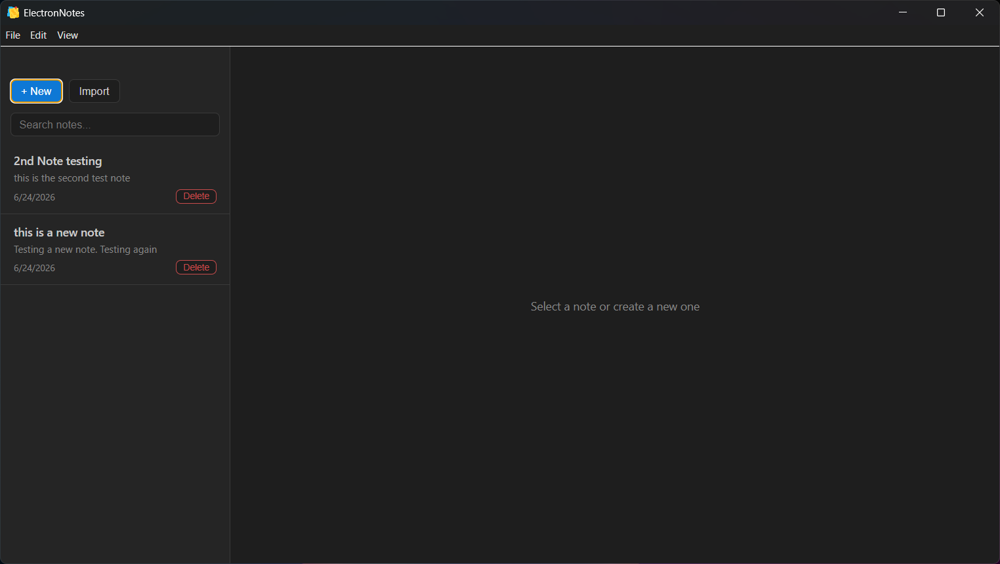

# ElectronNotes

A fast, minimal desktop notes app built with Electron, React, and SQLite. Write and organize notes locally — no account, no cloud, no subscriptions.



## Features

- **Instant saving** — notes save automatically as you type (debounced, no lag)
- **Full-text search** — search across all note titles and content
- **Import & Export** — open `.txt` / `.md` files, export notes to disk
- **Native menus** — File, Edit, and View menus with keyboard shortcuts
- **System tray** — runs quietly in the background, accessible from the tray
- **Auto-updates** — silently downloads and installs new versions on launch
- **Offline first** — all data stored locally in SQLite, nothing leaves your machine

## Download

Go to [Releases](../../releases/latest) and download the installer for your OS:

| Platform | File |
|----------|------|
| Windows  | `ElectronNotes-x.x.x-Setup.exe` |
| macOS    | `ElectronNotes-x.x.x.dmg` |
| Linux    | `ElectronNotes-x.x.x.AppImage` |

No Node.js or technical knowledge required — just download and run.

## Keyboard Shortcuts

| Action | Shortcut |
|--------|----------|
| New note | `Ctrl/Cmd + N` |
| Export note | `Ctrl/Cmd + E` |
| Undo | `Ctrl/Cmd + Z` |
| Redo | `Ctrl/Cmd + Shift + Z` |
| Select all | `Ctrl/Cmd + A` |
| Toggle fullscreen | `F11` / `Ctrl+Cmd+F` |

## Tech Stack

- **[Electron](https://www.electronjs.org/)** — cross-platform desktop framework
- **[React](https://react.dev/)** — UI components
- **[Vite](https://vitejs.dev/)** — fast dev server and bundler (via [electron-vite](https://electron-vite.org/))
- **[better-sqlite3](https://github.com/WiseLibs/better-sqlite3)** — local note storage
- **[electron-store](https://github.com/sindresorhus/electron-store)** — window state persistence
- **[electron-updater](https://www.electron.build/auto-update)** — automatic updates

## Development

### Prerequisites

- Node.js 18 or higher
- npm 9 or higher

### Setup

```bash
git clone https://github.com/YOURUSERNAME/electron-notes.git
cd electron-notes
npm install
```

### Run in development

```bash
npm run dev
```

This starts the Vite dev server with hot module reload and opens the app with DevTools.

### Run tests

```bash
# Unit tests
npm test

# End-to-end tests (requires a built app)
npm run build
npm run test:e2e
```

### Build for production

```bash
# Build without packaging (for testing)
npm run build

# Build and create installer for your current OS
npm run dist
```

Installers are output to the `dist/` folder.

## Project Structure

```
electron-notes/
├── src/
│   ├── main/
│   │   └── index.js          # Main process — window, menus, tray, IPC, DB
│   ├── preload/
│   │   ├── index.js          # contextBridge — secure API exposed to renderer
│   │   └── index.d.ts        # TypeScript types for window.electronAPI
│   └── renderer/
│       ├── index.html        # Entry HTML with Content Security Policy
│       └── src/
│           ├── App.jsx       # Root component, state management
│           ├── main.jsx      # React entry point
│           ├── components/
│           │   ├── NoteList.jsx  # Sidebar with search and note list
│           │   └── Editor.jsx    # Title input, textarea, word count
│           └── styles/
│               └── index.css     # Full layout, dark theme, drag regions
├── resources/
│   ├── icon.icns             # macOS app icon
│   ├── icon.ico              # Windows app icon
│   ├── icon.png              # Linux app icon
│   └── tray-icon.png         # System tray icon
├── tests/
│   └── notes.test.js         # Vitest unit tests
├── e2e/
│   └── app.spec.js           # Playwright end-to-end tests
└── electron.vite.config.js   # Vite + Electron build config
```

## Architecture

ElectronNotes follows Electron's two-process model with strict security defaults:

```
Main Process (Node.js)          Preload Script          Renderer (React)
─────────────────────           ──────────────          ────────────────
SQLite (notes DB)               contextBridge           NoteList
electron-store (prefs)    ←──── exposes safe API ────→  Editor
Native menus & tray             ipcRenderer             window.electronAPI
File dialogs (dialog)
Auto-updater
```

- `contextIsolation: true` and `nodeIntegration: false` are always enforced
- All IPC inputs from the renderer are validated in the main process
- Navigation to external URLs is blocked in-app and redirected to the system browser
- Content Security Policy is set in `index.html`

## Releasing a New Version

```bash
# Bump version, build, and publish to GitHub Releases
npm version patch   # or minor / major
git push && git push --tags
```

The GitHub Actions workflow (`.github/workflows/release.yml`) automatically builds installers for Windows, macOS, and Linux and uploads them to the release. Users with the app installed will receive the update automatically on next launch.

## Data & Privacy

All notes are stored in a local SQLite database at:

| Platform | Location |
|----------|----------|
| Windows  | `%APPDATA%\ElectronNotes\notes.db` |
| macOS    | `~/Library/Application Support/ElectronNotes/notes.db` |
| Linux    | `~/.config/ElectronNotes/notes.db` |

No data is ever sent to any server. The app works fully offline.

## License

MIT — see [LICENSE](LICENSE) for details.
